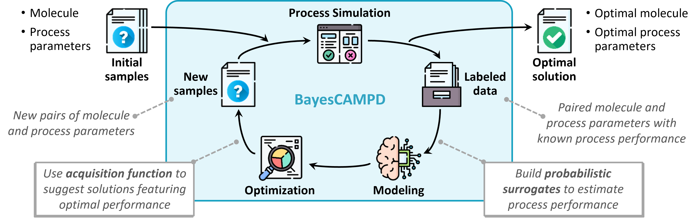

# Data-Driven Integrated Molecular and Process Design Using Bayesian Optimization

This repository contains the data and scripts involved in the manuscript:

**BayesCAMPD: Data-Efficient and Closed-Loop Integrated Molecular and Process Design Using Bayesian Optimization**

## Requirements 
### Library (Python 3.10)
* [SMT (Surrogate Modeling Toolbox)](https://smt.readthedocs.io/en/stable/): sampling methods
* [scikit-learn](https://scikit-learn.org/stable/): Gaussian process regression
* [SciPy](https://scipy.org/): differential evolution 
* [Matplotlib](https://matplotlib.org/): visualization

### Software
* Aspen Plus: chemical process simulation

## Note
The process simulation involved in this work is largely supported by our automated simulation tool, which can be found in the repository [**Aspen-Plus-Automation**](https://github.com/zwang1995/Aspen-Plus-Automation).  

## Authors
* [Zihao Wang](https://zwang1995.github.io/)
* [Prof. Dr.-Ing. Teng Zhou](https://facultyprofiles.hkust-gz.edu.cn/faculty-personal-page/ZHOU-Teng/tengzhou)
* [Prof. Dr.-Ing. Kai Sundmacher](https://www.mpi-magdeburg.mpg.de/person/24754/16345)
